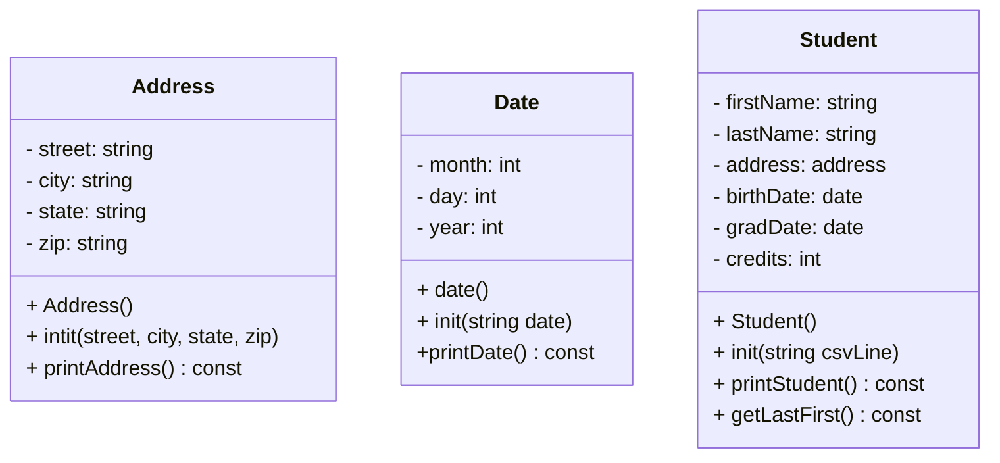

# Heap-of-Students
Part 1

Address:

 street, city, state, and zip as parameters

 assign street to the street data member
 
 assign city to the city data member

 assign state to the state data member

 assign zip to the zip data member

 end function

Date:

 receive dateString as input

 create a stringstream object using dateString

 get the month value from the stream

 ignore the slash

 get the day value from the stream

 ignore the slash

 get the year value from the stream

 store month, day, and year in the object

 end function

Student:

 csvLine as input

 create a stringstream object using csvLine

 use getLine with comma delimiter to extract:
      1. first name
      2. last name
      3. street
      4. city
      5. state
      6. zip
      7. birth date string
      8. graduation date string
      9. credit hours string

 convert credit hours string to an integer

 call address.init() using street, city, state, and zip

 call birthDate.init() using birth date string

 call gradDate.init() using graduation date string

 store the credit hours value

 end function

