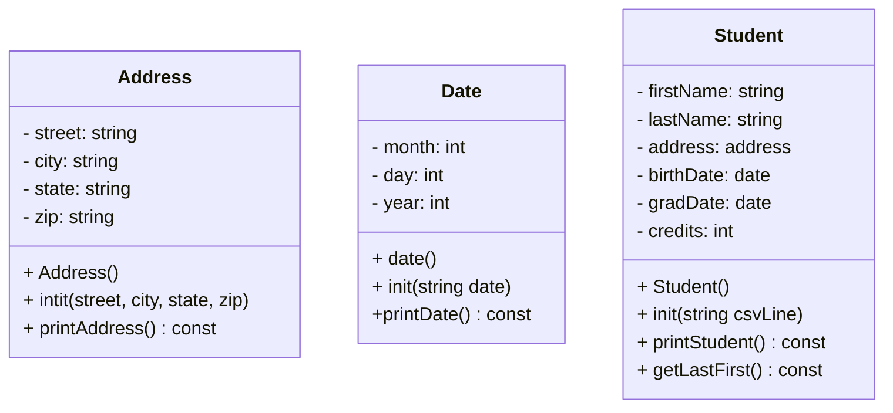

# Heap-of-Students
Part 1

```mermaid
classDiagram
class Address {
    - street: string
    - city: string
    - state: string
    - zip: string
    + Address()
    + intit(street, city, state, zip)
    + printAddress() const
}
class Date {
    - month: int
    - day: int
    - year: int 
    + date()
    + init(string date)
    +printDate() const
}
class Student {
    - firstName: string
    - lastName: string
    - address: address
    - birthDate: date
    - gradDate: date
    - credits: int
    + Student()
    + init(string csvLine)
    + printStudent() const
    + getLastFirst() const
}
```
